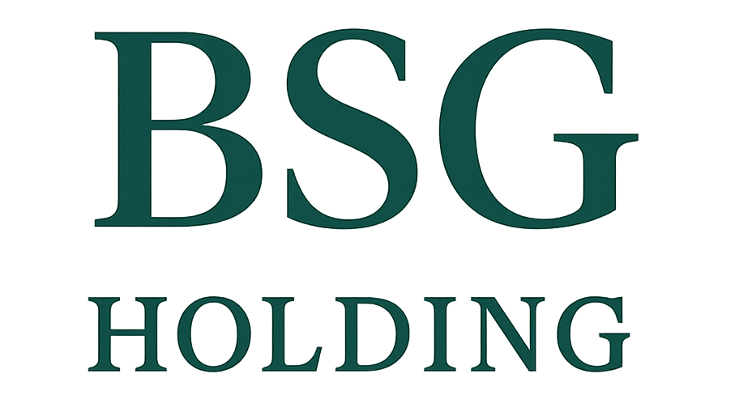

<div align="center">



# Beyond Scale Group

**BSG Stack** — the shared Claude Code skills, CI/CD workflows, and autonomous
agents every company in the portfolio inherits. One repo, one source of truth.

</div>

---

## The story

It started with a simple problem: every new software company acquired by BSG
came with its own CI/CD workflows, its own conventions, its own duct tape.
Three acquisitions in, we had three different Scala pipelines, two ways to
deploy on Clever Cloud, and zero consistency.

We did what any engineer would do: we centralized. One repo, reusable
workflows, shared conventions. But we didn't stop there.

Because BSG isn't a fund that buys and flips. It's a **forever hold**. Every
piece of software we acquire, we keep. Forever. And when you're holding 50
software companies forever, you need a **shared stack** — the connective tissue
that ties the portfolio together: CI/CD, Renovate configs, Claude Code skills,
release conventions, review apps, notifications.

**bsg-stack** is that foundation. One repo, one source of truth, zero
duplication.

---

## The stack

| Component | What it is |
|---|---|
| [**claude-skills/**](claude-skills/) | Claude Code skills, slash commands & subagents |
| [**renovate/**](renovate/) | Shared Renovate dependency-update presets |
| [**deploy/**](deploy/) | One-command deployment configs |
| [**docs/**](docs/) | Workflows, migration guides & reference |

## Get started

- **[INSTALL.md](INSTALL.md)** — install every component of the stack
- **[docs/workflows.md](docs/workflows.md)** — the reusable GitHub Actions workflows
- **[claude-skills/INSTALL.md](claude-skills/INSTALL.md)** — the skills & agents catalog

Reference a workflow from any repo in the group — no fork, no copy, no drift:

```yaml
jobs:
  test:
    uses: beyond-scale-group/bsg-stack/.github/workflows/test-scala.yaml@v2
    with:
      jdk: "21"
```

Versioning: `@v2` (current), `@v1` (frozen), `@vX.Y.Z` (exact). Migrating from
v1? See [docs/migration-v2.md](docs/migration-v2.md).

---

<div align="center"><sub><a href="https://bsg-holding.fr">Beyond Scale Group</a> — 50 companies, one stack.</sub></div>
